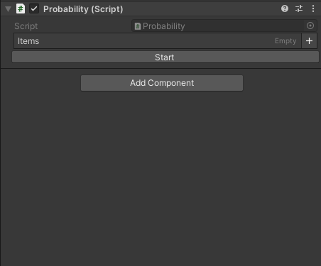

# Unity_Probability
A simple Editor can adjust the probability of items from Array.

* Updated to Latest, and Bugfixed which is based from: https://github.com/zxc30314/UnityTool_Probability

### Prerequisites
* Unity 2021.3+
* [Sirenix Odin - Inspector and Serializer](https://assetstore.unity.com/packages/tools/utilities/odin-inspector-and-serializer-89041)

### Demo

